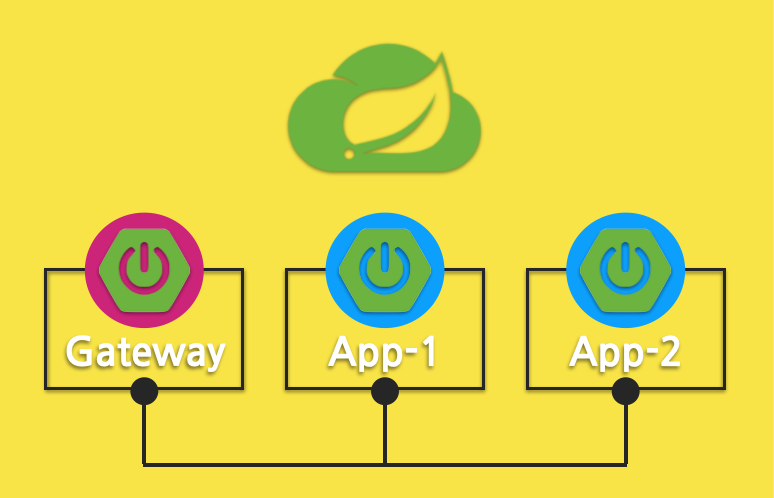
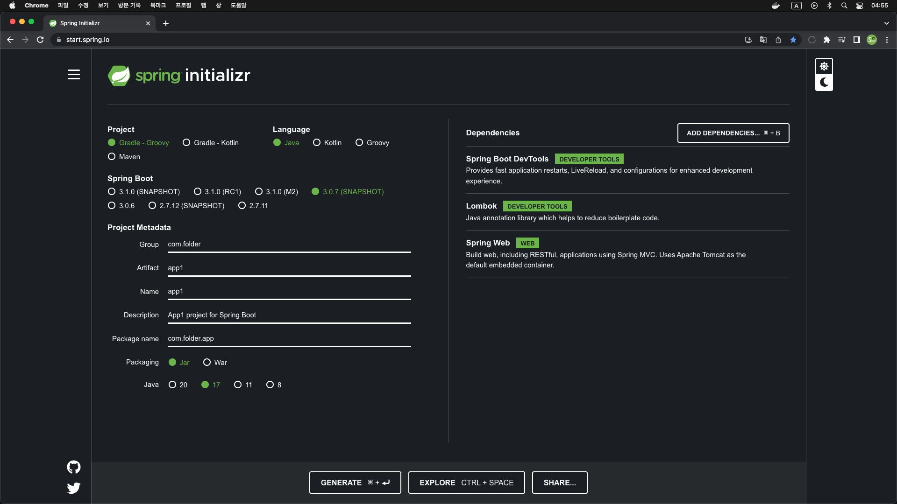
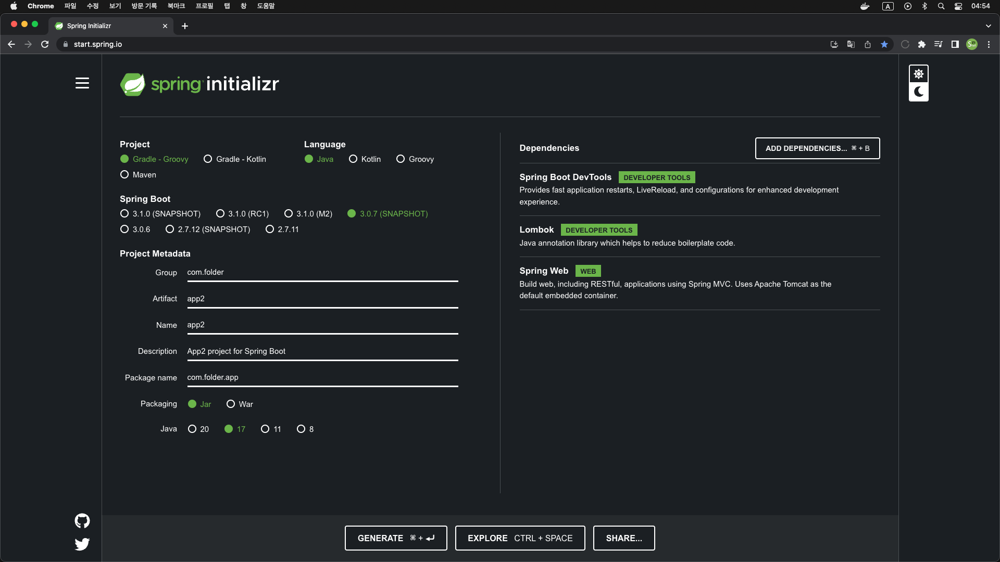

# DevGateway
Devcontainer + Spring Cloud Gateway

### Architecture
</img>

### Spring App initializr

#### - App1
</img>

#### - App2
</img>

### Cloud Gateway initializr

</img>

### Spring Project
> * [Spring initializr](https://start.spring.io/)
> * [Application Properties](https://docs.spring.io/spring-boot/docs/current/reference/html/application-properties.html)

> * [Cloud Gateway](https://spring.io/projects/spring-cloud-gateway)
> * [Cloud Gateway Docs](https://docs.spring.io/spring-cloud-gateway/docs/4.0.5-SNAPSHOT/reference/html/)

----
### YouTube Link

